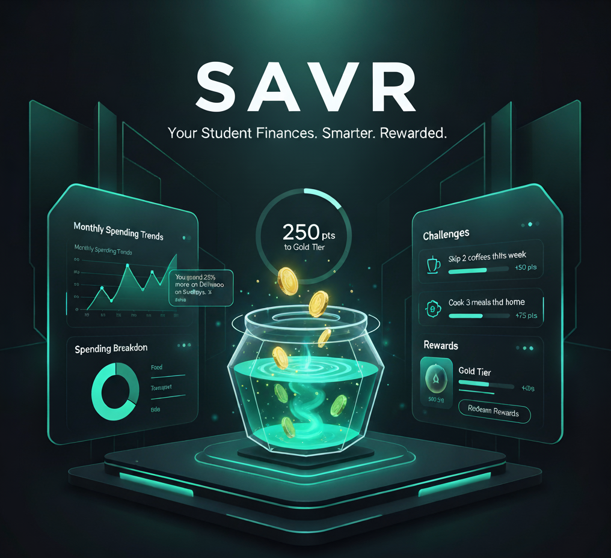
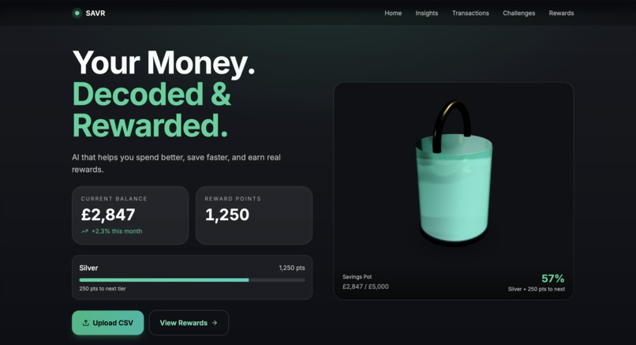
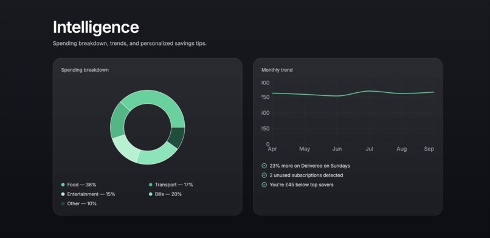
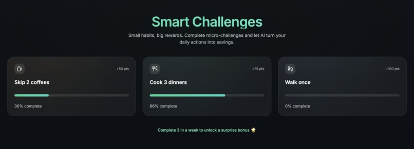
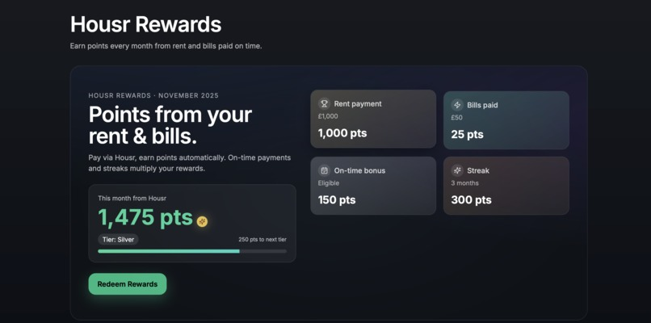
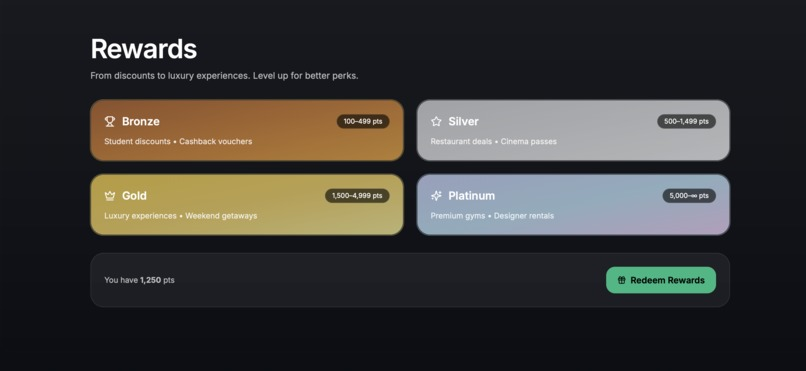

# **SAVR**

> 🥈 **2nd Place** at the **GreatUniHack** — **Housr Challenge**

---

## 🚀 Overview

**SAVR** is a student-focused, AI-powered financial intelligence platform that transforms raw spending data into actionable insights, gamified savings challenges, and tiered rewards. The React SPA delivers a cinematic, tactile journey from transaction upload to personalized suggestions, while the Python analytics engine processes transactions, detects anomalies, recurring subscriptions, and spending patterns. Together, SAVR helps students save smarter, spend consciously, and earn rewards — all with privacy-first, on-device analytics.  

---

## 💡 Core Features

### 💰 Smart Savings Hero

- 3D Savings Pot using **React Three Fiber + Drei + React-Spring** visually tracks balance vs. goal.  
- Animated liquid, coin-drop effects, and glass refraction respond in real time to deposits and tier progress.  
- Ambient UI elements reflect current reward tier (Bronze → Platinum) and points-to-next-level dynamically.  

### 🧠 Spending Analysis Lab

- Python-powered backend (`financial_logic/analysis.py`) ingests transactions, normalizes timestamps and categories, winsorizes outliers, and tracks spend/income flows.  
- Detects patterns: DOW/time-of-day peaks, merchant concentration, drip-spend leaks, ride-hail usage, late-night spending.  
- Highlights anomalies: weekly spikes, single-day outliers, duplicate charges, and ghost subscriptions.  
- Generates rule-based suggestions and micro-challenges (e.g., Grocery Trim, Subscription Audit) tied to real spending behaviour.  

### 🎯 Gamified Challenges & Insights

- React SPA displays challenges linked to actionable levers: skip coffees, cook meals at home, limit ride-hail trips.  
- Real-time progress tracking via **Framer Motion**, showing points earned and impact on Savings Pot.  
- Insights visualized with **Recharts**, showing category trends, month-over-month deltas, and spending vs. budget.  

### 🏆 Tiered Reward System

- Bronze → Platinum tiers with animated metallic gradients, glowing progress bars, and reward modals.  
- Redeem points for vouchers, experiences, and brand deals; all visually immersive with glassmorphic overlays.  
- Backend logic ensures rewards reflect real financial actions and evidence-based savings.  

### 🧮 Python Analytics Toolkit

- `financial_logic/analysis.py` orchestrates preprocessing, trend analysis, pattern mining, recurring detection, anomaly detection, budget variance, and suggestion generation.  
- Modular design enables SPA consumption of a single summary dict with: trends, anomalies, recurring items, suggestions, challenges, and projected savings.  
- Optional mock mode for demoing without live transactions or API access.  

---

## 🏗️ Tech Stack

| Layer | Technologies |
|:------|:-------------|
| **Frontend Runtime** | React 18, Next.js 14 |
| **Styling & Motion** | TailwindCSS, Framer Motion, React-Spring |
| **3D Graphics** | React Three Fiber, Drei, Rapier Physics |
| **Charts & Analytics** | Recharts |
| **Smooth UX** | Lenis scroll inertia |
| **Backend Analytics** | Python 3.10+, Pandas, NumPy |
| **AI / Optional** | GPT/Gemini API for insights |
| **Database / Persistence** | Supabase or Firebase |
| **Version Control** | GitHub |
| **Deployment** | Vercel |

---

## 🧠 Why SAVR Stands Out

✅ **Full-spending visibility** — transforms raw transactions into digestible, human-centred insights.  
✅ **Gamified saving journey** — 3D Savings Pot and challenges drive motivation and micro-behaviour change.  
✅ **AI-backed suggestions** — personalized tips for reducing recurring subscriptions, late-night spending, and drip leaks.  
✅ **Privacy-first design** — all transaction analytics can run locally; optional anonymized cloud storage.  
✅ **Tiered rewards ecosystem** — incentivizes consistent savings with tangible, visually appealing benefits.  
✅ **Engaging UI** — cinematic, glassmorphic interface with fluid transitions and responsive charts.  

---

## 🏅 Milestones & Achievements

| **Milestone** | **Criteria** |
|---------------|--------------|
| First Transaction Uploaded | Connect CSV/API and process initial transactions |
| Insight Explorer | View category breakdown, trends, and anomalies |
| Challenge Initiator | Complete first gamified spending challenge |
| Reward Achiever | Reach next tier in Savings Pot and redeem points |
| Pattern Detective | Trigger recurring detection, anomaly flags, and suggestions |
| Smart Saver | Complete three challenges, reducing top spend categories |
| Analytics Master | Explore full 30-day trend, projections, and AI insights |

---

## 🌐 User Journey

1. **Landing Dashboard** – Hero section with Savings Pot, reward tier, and points-to-next-level overlay.  
2. **Transaction Upload** – CSV/API ingest, preprocessing, and normalization.  
3. **Spending Analysis** – AI-driven insights, trend charts, and anomalies displayed.  
4. **Challenges & Suggestions** – Gamified tasks linked to real savings actions.  
5. **Reward Redemption** – Tiered reward system with immersive modals and progress indicators.  
6. **Ongoing Monitoring** – Users track spend, challenges, and projected savings dynamically.  

---

## 🔮 Future Enhancements

- 🪙 **Real-time bank sync** — auto-update transactions from multiple institutions.  
- 📊 **Advanced forecasting** — hybrid seasonal + moving-average predictions for smarter budgeting.  
- 🧩 **Adaptive challenges** — AI-curated suggestions based on changing spending behaviour.  
- ☁️ **Persistent cloud profiles** — multi-device continuity with Supabase/Firebase.  
- 📱 **Mobile companion app** — wrap SPA in Capacitor/Expo for Android/iOS.  

---

## 📁 Quick Reference

SAVR delivers a premium, gamified student finance experience that blends **data intelligence, AI insights, and immersive visuals** — helping young adults save smarter while feeling rewarded. 💎  

---

## 📸 Gallery

| Landing Page | Spending Trends | Challenges |
|:---:|:---:|:---:|
|  |  |  |

| Rewards | Achievement |
|:---:|:---:|
|  |  |
